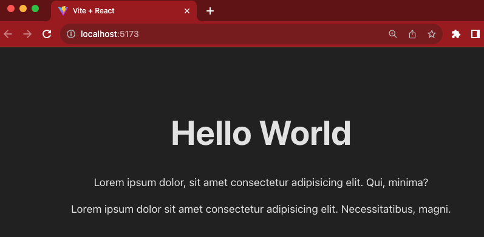
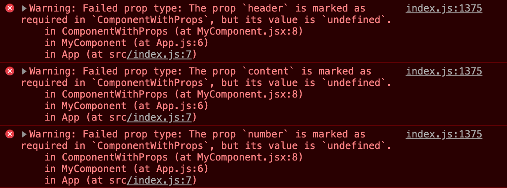
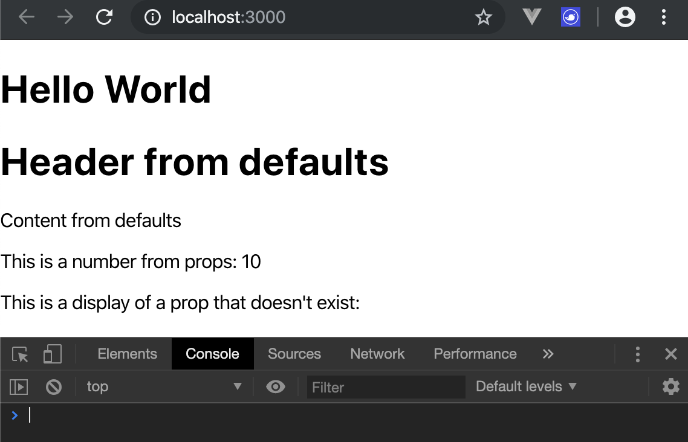
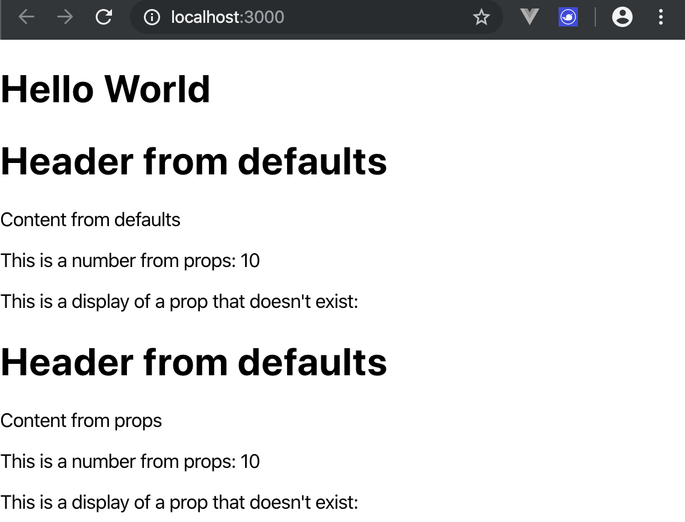

# ACTIVITY 1 - Get a ReactJS application up and running

## Objectives - Activity 1

- To be able to scaffold an application using Vite and add testing tools to it
- To be able to launch the application in the browser using the command line

## Overview - Activity 1

In this activity, you will set up a ReactJS application using a special node package extractor called vite. Once the installation of files has completed, you will launch the application in the browser and see it running.

## Actions - Activity 1

1. Using **CTRL + \'** on the keyboard
    (**CTRL + \`** on MacOS) or by using click-path **View -- Terminal**
    (or **Terminal -- New Terminal** on **MacOS**), open **VSCode\'s**
    integrated terminal or click the terminal icon on the bottom bar.

2. Using the cd command, navigate to the **ActivityFiles/IntroductionToReactJS/**
    folder.

3. Create a *new* ReactJS application using the command:

```sh
npm create vite@latest
```

Accept any invitation to install `create`.

4. Name the project **vite-project**, select `React` and `JavaScript` in the options.

5. Follow the instructions to change folder, ***run an install and then run the application***.
6. Stop the app running and then install the testing dependencies using the command:

```sh
npm i -D vitest jsdom @testing-library/react @testing-library/jest-dom
```

Wait for the installation to complete.

7. Next add the following command to the set of **scripts** in **package.json**:

```sh
"test": "vitest"
```

Don't forget to add a `,` to the end of the preceding line!

8. Create a file called **setup.js** in a new folder called **tests** in the root of the project and populate it with the following code:

```javascript
import {  afterEach } from 'vitest';
import { cleanup } from '@testing-library/react';

afterEach(() => {
  cleanup();
});
```

9. Edit vite.config.js, so it contains the following:

```javascript
plugins: [react()], // already there
test: {
    environment: 'jsdom',
    setupFiles: ['./tests/setup.js'],
    testMatch: ['./tests/**/*.test.jsx$?'],
    globals: true
  }
```

10. Edit the .eslintrc.cjs so that it doesn't fill your test files with red underlines by adding `, vitest: true` to the `env` key in the object (it already contains `browser: true` and `es2020: true`)

11. Make the test runner execute - it should tell you that it couldn't find any test files - which is right as we haven't written any!

### Bonus - add Code Coverage to Vitest

Follow the instructions here:

[Vitest Coverage Guide](https://vitest.dev/guide/coverage.html)

**Note:** ***Istanbul*** is the coverage tool to choose here - for your Academy journey anyway!

>This is the end of this activity.

---

## ACTIVITY 2 - Build and Serve an Application

## Objectives - Activity 2

- To be able to build production-ready code using the scripts provided in the application
- To understand what the build process creates and where the files are put

## Overview - Activity 2

In this activity, you will produce a production-ready set of code for the skeleton application. This will make bundles of the HTML, CSS and JavaScript needed to efficiently deploy the application. You will explore the files that are created and view the application in the browser.

## Actions - Vite Project

1. In VSCode, if the server is running on the command line, press
    **CTRL+C** to stop it.

2. Make sure that the command line is pointing to
    **activity-files/IntroductionToReactJS/vite-project**.

3. Make a production ready version of the application by typing:

```sh
npm run build
```

4. Once the process has finished, preview the application using the command:

```sh
npm run preview
```

5. Open the browser at the provided location (`http://localhost:<some_port_number>`) and view the application.

7. Browse the files created in a new folder called **dist** in the application root:

    - Find **index.html** and its reference to the JS file;
    - Find the JavaScript file -- view these in **VSCode**.

Building the application optimises the files for the fastest download without affecting functionality.

>This is the end of this activity.

---

## ACTIVITY 3 – Create Function Components

In this ACTIVITY, you will:

- Add Function components to your application
- Render the new components as  a children of other components

### Outcomes

- To be able to create Function components
- To be able render components as children of others

### Overview

In this QuickLab, you will create Function components in their own files. You will then import these components into parent components, rendering as part of the parent's return.

### Actions -- Part 1 -- MyComponent

**Work in the IntroToReact Vite project you created in the Activity 1.**

1. Create a new file called **MyComponent.jsx** in the
    **src** folder.

2. Create a `const` called `MyComponent` as an *arrow function* that takes
    *no arguments*.

3. Make the function return a single \<h1> with the text Hello World.

4. `export` `MyComponent` as a `default`.

5. Open **App.js** from the same folder and *delete EVERYTHING* in its
    return.

6. Put MyComponent as an *element* in the return, ensuring that it is
    *imported*.

7. Save all files and run the application -- use npm run dev from the
    command line if required.

The app's display should now have been replaced with the content provided in **MyComponent**.

### Actions -- Part 2 -- AnotherComponent

**Work in the IntroToReact Vite project you created in the Activity 1.**

1. Create a new file called **AnotherComponent.jsx** in the
    **src** folder.
2. Create a `const` called `AnotherComponent` as an *arrow function* that
    takes *no arguments*.

3. Make the function return a **React Fragment** `<> </>` with 2
    **paragraphs** that contain some text -- we used 10 '*lorem ipsum*'
    words.

4. `export` `AnotherComponent` as a `default`.

5. Open **MyComponent.jsx** and add `<AnotherComponent />` *under* the
    `<h1>` and wrap both in a React Fragment `<> </>` (ensuring
    **AnotherComponent** is *imported*).

6. Save all files and run the application (`npm run dev` from the
    command line).

You should see the text from **AnotherComponent** seamlessly displayed.



>This is the end of this activity.

---

## ACTIVITY 4 - Creating a Class Component

### Outcomes - Activity 4

- To be able to create a Class component
- To be able to nest components in others

### Overview - Activity 4

In this activity, you will create a new Class Component. You will then nest this new component in the existing App component.

### Actions - Activity 4

**Work in the IntroToReact Vite project you created in the Activity 1.**

1. Create a new file called **MyClassComponent.jsx** in the
    **src** folder.

2. Create a `class` called `MyClassComponent` that `extends` `Component`.

3. Make the render function return a **React Fragment** `<> </>` with a `<h2>` and a `<p>` that contains some text.

4. `export` the `MyClassComponent` as a `default`.

5. Open **MyComponent.jsx** and add `<MyClassComponent />` under the `<AnotherComponent />` (ensuring **`MyClassComponent`** is **imported**).

6. Save all files and run the application (**`npm run dev`** from the command line if not running already)

You should see the **`MyClassComponent`** seamlessly displayed with all of the others.

>This is the end of this activity.

---

## ACTIVITY 5 - NO ACTIVITY

---

### ACTIVITY 6 & 7 are in the StaticVersion folder

[Link](../StaticVersion/README.md)

---

## ACTIVITY 8 - Exploring Props

### Objectives - Activity 8

- To be able to use props in a component
- To be able to define propTypes for a component's props and ensure that they are present if needed
- To be able to supply defaultProps for a component
- To be able to pass props to a child from its parent

## Overview - Activity 8

In this activity, you will create a component called **ComponentWithProps** that uses 4 props (**header**, **content**, **number** and **nonexistent**) to populate a header and 3 paragraphs in its **return**. This will be rendered by the **MyComponent** component.

You will observe the output and then add **PropTypes** for **header**, **content** (both strings) and **number** that are all required. The browser output will be observed again. Next, **defaultProps** will be added for header, content and number before providing actual props for **content** and **number** when it is called in the render of **MyComponent**. Finally, you will inspect the browser output to ensure all warnings have been removed.

## Actions - ComponentWithProps - Step-by-Step

**Work in the IntroToReact Vite project you created in the Activity 1.**

1. Create a new file called **ComponentWithProps.jsx** in **src**.
2. Define a **Function component** called `ComponentWithProps` that has `props` as an argument and a return that has:
    - A wrapping **React Fragment**;
    - A `<h1>` that uses `header` from `props` as its content;
    - A `<p>` that uses `content` from `props` as its content;
    - A `<p>` that uses `number` from `props` as its content along with *some text*, also add an attribute of `data-testid` set to `"numberPara"` (for use in testing later);
    - A `<p>` that uses `nonexistent` from `props` as its content along with *some text*.
3. `export` `ComponentWithProps` as `default`.
4. Save the file.
5. Open **MyComponent.jsx** for editing and import the *new component*.
6. *Add it* to the return but ***DO NOT*** supply any props at this point.
7. Ensure that you wrap the return of **MyComponent** in a **React Fragment**.
8. Save the file and run the application.

>You should find that the application runs without errors (check the console), although there are empty elements where props were not found and spaces where props where included as part of other text.

### Actions - Using PropTypes - Step-by-Step

1. In **ComponentWithProps.jsx**, add an `import` for `PropTypes` from `prop-types`.
2. Before the `export` statement, add `ComponentWithProps.propTypes` and set it to an **object**.
    - Add **keys** of `header` and `content` with **values** that will **ensure** that **both** are **required** **strings**;
    - Add a key of `number` with a **value** that will ensure it is a **required** **number**.
3. Save the file and return to the browser console output.

> You should see that the application still renders the same but there are 3 warnings displayed on the console.



### Actions - Using defaultProps - Step-by-Step

1. Under the **PropTypes** defined in the last part, add a declaration for `ComponentWithProps.defaultProps` and set it to an object.
    - Add a **key** of `header` with string **value** `Header from defaults`;
    - Add a **key** of content with string **value** `Content from defaults`;
    - Add a **key** of number with a **value** of `100`.
2. Save the file and check the browser console output.

> You should see that the warnings have disappeared, with values supplied as defaults displayed on the web page.



## Actions - Supplying props from the Parent -- Step-by-Step

1. Open **MyComponent.jsx** for editing and add another **ComponentWithProps** to the return, supplying the following **`props`** (attributes):
    - `content` with a string **value** of `Content passed from props`;
    - `number` evaluated in JavaScript to `10`.
2. Save the file and view the browser.

>You should notice that the values displayed on the web page in the second rendering of **ComponentWithProps** match those to where they are picked up from in the code.



>This is the end of this activity.

---

## ACTIVITY 9 - Testing Props

### Objectives - Activity 9

- To be able to use @testing-library/react to be able to test that supplied props are rendered in components

## Overview - Activity 9

In this activity, you will write 3 tests for the **ComponentWithProps** component. The tests will ensure that if one of the props that is rendered as part of the component is supplied, it is in fact rendered. The tests will use the create function supplied by react-test-renderer and generate a test instance of the component. Following this, the component will be interrogated using the **testInstance** functions **findByType** and **findAllByType**. Checking the children property of the 'rendered' instance will allow the value that will be displayed to be checked. These are tested as they affect the view that the user will see.

It is assumed that **PropTypes** and **defaultProps** that are supplied to the component are not the concern of the developer as these are part of React and are therefore assumed to be tested!  We could question as to whether these test are necessary at all!  If there is logic applied to transform the props in any way then that is a suggestion that we need a test!

### Actions 9.1 - Test the header prop

1. Create a folder in **src** called **tests** and create a file called **ComponentWithProps.test.jsx**.
2. Add an `import` for `{ render, screen }` from `@testing-library/react`.
3. Import `ComponentWithProps` from its file.
4. Define a test with the **title** of `it should render the correct heading from props when a header prop is supplied` and initialise an arrow function as a callback.
5. Populate the arrow function with code that:
    - Defines a `const` called `testHeaderValue` set to a **string** with *some
        text*;
    - Calls `render` with a `ComponentWithProps` component that has a **`prop`** of `header` set to `testHeaderValue`;
    - **Asserts** that the query`getByText` on `screen` using `testHeaderValue` will *be in the document*.
6. Save the file and run the command `npm test` on the command line.

>This test should pass -- change the assertion to make it fail and then make it pass again.

## Actions 9.2 - Test the content prop

1. Define a test with the **title** of `it should render the correct content from props when a content prop is supplied` and initialise an arrow function.
2. Populate the arrow function with code that:
    - Defines a `const` called `testContentValue` set to a **string** with *some text*;
    - Calls `render` with a `ComponentWithProps` component that has a **`prop`** of `content` set to `testContentValue`;
    - **Asserts** that the query`getByText` on `screen` using `testHeaderContent` will *be in the document*.
3. Save the file and observe the test results.

>This test should pass -- change the assertion to make it fail and then make it pass again.

### Actions 9.3 - Test the number prop

1. Define a test with the **title** of `it should render the correct number from props when a number prop is supplied` and initialise an arrow function.
2. Populate the arrow function with code that:
    - Defines a `const` called `testNumber` set to any number;
    - Calls `render` with a `ComponentWithProps` component that has a **`prop`** of `number` set to `testNumber`;
    - **Asserts** that the query`getByTestId` on `screen` using `numberPara` and accessing it's `textContent` will *contain* the `testNumber` as a `string`.
3. Save the file and observe the tests.

>This test should pass -- change the assertion to make it fail and then make it pass again.
>This is the end of this activity.

---

## Legacy Activities

These activities were for the zero-configuration project scaffolding in Create-React-App.  It may be of use to you if you come across applications that were scaffolded in this way.

## Objectives - Activity 1 Legacy

- To be able to use the create-react-app node package extractor to quickly scaffold a ReactJS application.

## Actions - create-react-app

1. Using **CTRL + \'** on the keyboard
    (**CTRL + \`** on MacOS) or by using click-path **View -- Terminal**
    (or **Terminal -- New Terminal** on **MacOS**), open **VSCode\'s**
    integrated terminal or click the terminal icon on the bottom bar.

2. Using the cd command, navigate to the **ActivityFiles/IntroductionToReactJS/**
    folder.

3. Create a *new* ReactJS application using the command:

```sh
npx create-react-app cra-project
```

Wait for the installation to complete.

4. Use the `cd` command to change into the **starter** folder and then
    run the application by using the command:

```sh
cd starter && npm run dev
```

Your browser should open at [*http://localhost:3000*](http://localhost:3000) with the following
screen (or similar):


---

## ACTIVITY 2 - Build and Serve an Application - Create-React-App

## Objectives - Activity 2 - Legacy

- To be able to build production-ready code using the scripts provided in the application
- To understand what the build process creates and where the files are put

## Overview - Activity 2 - Legacy

In this activity, you will produce a production-ready set of code for the skeleton application. This will make bundles of the HTML, CSS and JavaScript needed to efficiently deploy the application. You will explore the files that are created and view the application in the browser.

## Actions - CRA Project

1. In VSCode, if the server is running on the command line, press
    **CTRL+C** to stop it.

2. Make sure that the command line is pointing to
    **activity-files/IntroductionToReactJS/cra-project**.

3. Make a production ready version of the application by typing:

```sh
npm run build
```

4. Once the process has finished, install a server to view the
    application:

```sh
npm i --location=global serve
```

5. Once the installation is complete, run the app in the server:

```sh
serve -s build -p 4000
```

6. Open the browser to [*http://localhost:4000*](http://localhost:4000/) and view the application.

7. Browse the files created in a new folder called **build** in the application root:

    - Find **index.html** and its reference to the JS files;
    - Find the JavaScript files -- view these in **VSCode**.

Building the application optimises the files for the fastest download without affecting functionality.
