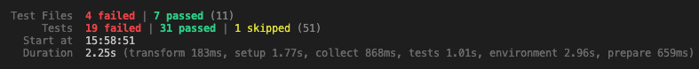

# Creating a Routed Application

## Activity 19 - Prepare the Main Application for Routing

## Outcomes - Activity 19

- To be able to use simple routes in an application

- To be able to add internal links to an application

## Overview - Activity 19

In this activity, you will add routes to **App.jsx** for the default view, which will be the list of **AllTodos** and an **AddTodo** view, which will display the **AddEditTodo** component. To do this, an extra package called **react-router-dom** will need to be added to the project. A **BrowserRouter** component will wrap the whole application to enable routing. **Route** component will be defined in a **Routes** component to ensure that matches are made.  All traces of the `selectedId` state will be removed from the **App** component.

Once the application routing has been defined. The Header component will be modified to use a **Link** component rather than the usual `<a href>` combination to use React's routing system.

You should use the **RoutedApp/starter** folder as the ***'Edit Todo'*** functionality has been included.

### Action 1 -- Setting up for routing

1. Ensure that JSON server is running a serving the **todoData.json**
    file.

```sh
json-server todoData.json -p 4000 --id _id
```

2. Point a command line at the root of your project and install **react-router-dom** using the following command:

```sh
npm i --save react-router-dom
```

3. Open **main.jsx** for editing.
4. **Import** `BrowserRouter`  from **react-router-dom**.
5. Wrap the **App** component in a `<BrowserRouter>` component.

---

### Action 2 - Define the application\'s Route components

1. Open **App.jsx** for editing.
2. Import `Routes` and `Route` from **react-router-dom**.
3. Surround the call for the **AllTodos** and **AddTodo** components with a `<Routes>`.
4. Render a `<Route>` that has an `path` set to `"/"` and an `element` that would render the current `<AllTodos...>` component (including its props but removing the `selectTodo` prop);
5. Render another `<Route>` that has an `path` set to   `"/add"` and an `element` that would render the current `<AddEditTodo...>` component (including its props but remove the `selectedId` prop completely);
6. Remove all other lines of code that declare or set `selectedId`, removing the `selectTodo` function entirely.
7. Save the file and check that the navigation works as expected when the path is typed into the address bar.

Notice how the application re-renders completely when an address is typed and that the **Edit** button on **AllTodos** does not appear to have any affect now.

---

### Action 3 -- Add navigation to the Header**

1. Open **Header.jsx** for editing from the Components folder.
2. **Import** `Link` and `NavLink` from **react-router-dom** (inside `{}`)
3. Locate the link surrounding the text ***Todo App*** and:
     - Replace the `<a></a>` with `<Link></Link>`;
     - Replace `href=` with `to=`.
4. Add links for **Todos** and **Add Todo** that sit inside a **div** with **classes** of `collapse navbar-collapse`.  Each link should be:
     - A **`NavLink`** that has:
       - a `to` attribute of `"/"` or `"/add"`;
       - a `className` of `nav-link` by default and an of `nav-link active` when `isActive` reports `true`.
5. Save the file.

Check that the application now renders without completely refreshing the application - check the network activity in the Developer Tools to make sure!

Start the `json-server` again.

Try clicking on **Edit** in the table and then on the **Add Todo** link. You will notice that the todo is displayed in the form and you can submit it. This will cause the form to rerender and display a blank form. If you navigate to home, then the edited todo has been saved.

---

### Activity 4 - Fix the now-failing tests

Adding routing to the application causes some of the tests to fail as they render routing components.  To fix the, we will wrap the render of the components in these failing tests with a `<MemoryRouter>` component.  This is provided, mainly for the purposes of testing by the **react-router-dom** package.  In the case of the `App` component, we will need to provide some initial route details for some of the tests so the render is correct for what we are testing.

#### Activity 4.1 - Header Tests

1. Open **Header.test.jsx** for editing.
2. Import the `MemoryRouter` component from `react-router-dom`.
3. Surround the `render` of the `Header` component with a `MemoryRouter` component.

Note, if you add the functionality to make the responsive menu expand and collapse, we might need to change this snapshot test for something more sophisticated!

#### Activity 4.2 - App Tests

1. Open **App.test.jsx** for editing.
2. Import the `MemoryRouter` component from `react-router-dom`.
3. Surround the `render` of the `App` component in EVERY test with a `MemoryRouter` component.
4. Skip the final suite that tests the ***edit*** functionality.  We'll deal with this test when we have reinstated this.

> There is a better way to write these tests, which will be included in the Solution for Activity 20 that involves making the `MemoryRouter` render the path without needing to simulate a click on it.  Testing that the actual routing works is not our responsibility as the `react-router-dom` package should deal with that and we should be able to rely on it doing its job, as long as we define the routes correctly!

>This is the end of this activity

---

## Activity 20 - Use Parameterised Routes

## Outcomes - Activity 20

- To be able to use parameters to define and evaluate routes

- To be able to use parameter data in view logic

## Overview - Activity 20

In this activity, you will add the **Route** to be used by an edit link and pass in the `_id` of the todo that is to be edited, setting **`:\selectedId`** as a **Route** parameter in the **`path`**. The current link in the **Todo** component will be updated to use a **Link** component along with the `_id` to dynamically create a link for each todo in the **AllTodos** component.

The **AddEditTodo** component will be modified so that it recognises the todo that has been chosen for editing. This will be done by leveraging the **useParams** hook that is supplied as part of the *react-router-dom package* to identify the `selectedId` of the todo to update from the route path that has been activated.

The `selectedId` will help find the todo from the array of todo objects and then parse the values into the form. The update function will operate in the same way as before.

We will add a **Navigate** to show the list of todos when submit is clicked and also some error handling for situations where the `todos` or `selectedId` are not available.

You should continue use the **RoutedApp/starter** folder or the **solution-activity19** folder.

### Action 1 - Add a Route for editing a Todo

1. Ensure that JSON server is running as in previous activities.
2. Open **App.js** for editing.
    - In the `<Route>` for `/add`, change the `submitTodo` prop's name to `submitAction` and remove all other props.
    - Under the `<Route>` for `/add` add another `<Route>` with a `path` set to `"/edit/:selectId"`;
    - Make the `Route` component render an `element` with an `<AddEditTodo />` that has props:
        - `submitTodo` set to `{submitTodo}`;
        - `todos` set to `{todos}`
3. Save the file.

---

### Action 2 - Link \'Edit\' in the table to the Route

1. Open **Components/Todo.jsx** for editing.
2. **Import** `Link` from `\'react-router-dom\'`.
3. Add `_id` to the deconstruction of the `todo` prop.
4. Change the `<span></span>` that surrounds **`'Edit'`** to a `<Link></Link>` that has attributes:
    - `to` set to **{\`/edit/${_id}\`}**;
    - `className` set to `link`;
    - As you have removed the `selectTodo` callback from the link, if you have ***deconstructed*** the **props**, you can remove `selectTodo` from there and the **propTypes** and anywhere else `selectTodo` is used.
5. Save the file.
6. For code cleanliness, remove `selectTodo` from the **props** of the **AllTodos** component.

Return to the browser and check that clicking on one of the Edit links produces a URL that has `/edit/` followed by the `_id` contained in the JSON file for that todo. Note that there will not be anything displayed!

---

### Action 3 - Make the AddEditTodo component recognise the Todo to edit

1. Open **Components/AddEditTodo.jsx** for editing.
2. Remove `selectedId` from **props** and **propTypes**.
3. Add an **import** of `useParams` from **react-router-dom**.
4. Add a **new state** called `submitted` initially set to `false`.
5. Declare a **const** `{ selectedId }` to be a call to the `useParams` hook.
6. In the `submitHandler` function, call `setSubmitted` with `true` as its last action.
7. In the `return`, after the opening fragment, insert a line that renders a `Navigate` component (imported from `react-router-dom`) that has a `to` attribute set to `"/"` if `submitted` is `true`.

---

### Action 4 - Make the TodoForm recognise error conditions and display a modal

1. Open **Components/TodoForm.jsx** for editing.
2. Add a **new state** of `error`, initially set to an *object* with **keys** `display` and `message` set to `false` and an empty string respectively.
3. Under the `dateCreatedContent` declaration, add another called `errorModalContent` that is a JSX expression that renders:
   - If `error.display` is true, returning an `InfoModal` with props
     - `closeModal` - a function that calls `setError` with a *spread* of the `error` state, updating `display` to `false`
     - `message` - set to `error.message`
   - If `!error.display` and the `length` of `error.message` is *greater than* `0`, return a `Navigate` component with a to attribute set to `"/"`
4. Render `errorModalContent` as the first element in the return of the component.

---

### Action 5 - Modify the useEffect so it sets the todo if selected and an error if something goes wrong and also clears the selected todo when the component is removed

1. Import the `useLocation` hook from `react-router-dom` and deconstruct a call to it to `{ pathname }`, declaring this under the component's state declarations.
2. In the `useEffect`'s `if` statement, add a condition to check to see if the `todos` array can be interrogated with the `find` function, looking to return the `todo` found whose `_id` matches `selectedId`
3. Add an `else` clause to this `if` statement that calls `setError` with an *object* with **keys** `display` and `message` set to `true` and the string `"That todo could not be found, you will be returned to the todos list to try again"`.
4. Surround this whole *if-else* statement with another `if` statement that checks to see if `pathname` `includes` the string `"edit"`
5. Add a `return` function to the `useEffect` that sets ALL state back to their original values - this is useful to stop the todo's data persisting in the form if you click *Edit* and then use the *Add Todo* link in the navigation bar!

### Action 6 - Make a error modal appear if the edit page is landed on without the todos being retrieved from the server

1. Add a second `useEffect` that checks to see IF `pathname` `includes` the string `"edit"` and nest another that checks to see IF the `length` of `todos` is `0`, setting the error state to an *object* with **keys** `display` and `message` set to `true` and the string `"There are no todos loaded, you will be returned to the home page to try a reload"`.
2. Add a dependency of `todos` to the the hook.

> Check the navigation in the browser, you should see that the \'Edit\' link now populates the form with the selected Todo and when submitted, the updated Todo is shown in the AllTodos table.
>
> You should find that clicking Submit after using the \'Add Todo\' main navigation link returns to the list of Todos showing the newly added Todo in it.
>
> Try turning the server off at different points of the add/edit process and make sure that the modals display with the correct information.
>
>This is the end of this activity.

---

## Activity 21 - Tests

After you have completed Activity 20, try running the tests and you should find that we have somewhat broken the testing!



The following instructions will put you back on the road to 100% passes with 100% coverage!

### The Todo Component Tests

#### Fix or remove

1. TWO of the failing tests in this file are easily fixed by wrapping each component tree in the `render` calls with a `MemoryRouter` component, importing it from `react-router-dom`.

> You will notice that the solution files create a TodoTestWrapper component that includes the MemoryRouter component and the required table components for the correct render of the **Todo** component.  The **Todo** component will be inserted into where `children` is.

```jsx
// Syntax
render(<MyComponent>, {wrapper: WrapperComponent});
```

2. The remaining failing test in this file is checking to see if `selectTodo` is called when the edit link is click on - as we are no longer using this function, the test can be deleted!

#### Add new tests?

If you are hell-bent on checking you are constructing the correct route, you can do this!

1. In the `Edit Todo selection tests` suite, add a `test` with the title: `'should have the todo\'s id as part of the href attribute on the edit link'`
2. Set `testTodo`'s `todoCompleted` property to `false`.
3. Add an `_id` property to `testTodo` set to the string `testtodoid`
4. Render the component (complete with the wrapping `MemoryRouter` and the table elements), supplying a `todo` prop of `testTodo`
5. *Get* the edit link from the rendered screen
6. *Assert* on the edit link, using matcher `toHaveAttribute` and ***string*** arguments `href` and `/edit/${testTodo._id}`.
7. Save and run the tests in this file - there should now be ***5*** passing tests!

### The AllTodos Tests

There's a single failing test in this file - fixed by wrapping the render in the first test with a `MemoryRouter` component in the same way as for the **Todo** component.

### The AddEditTodo Tests

There are 4 failing tests in this file, ***3*** for *adding* and ***1*** for *editing*.

#### Adding tests fix

These 3 tests can be easily fixed by:

1. Wrapping the rendered component in a `MemoryRouter`
2. Adding a **prop** of `todos` set to `sampleTodos`

#### Edit tests fix

This is more complicated as the error displayed is:

<span style="color: red; font-family: Monospace;">
    Error: useLocation() may be used only in the context of a &lt;Router&gt; component.
</span>

Surrounding the rendered component with a MemoryRouter helps with this, but remember that we changed how the `selectedId` was set.  To provide the test with the correctly rendering component - complete with being able to access the value from the `useParams` hook, we need to configure the MemoryRouter component to understand the routes and parameters in the routes.  

1. In the edit test suite, create a `beforeEach` that:
   - Declares `routes` as a `const` of type *array* with 2 objects:
     - **Object 1:** *Keys:* `path` and `element` set to the string `'/edit/:selectedId'` and `<AddEditTodo submitTodo={mockSubmitTodo} todos={sampleTodos} />`
     - **Object 2:** *Keys:* `path` and `element` set to the string `'/'` and `<></>`
   - Declares `router` as a `const` that is a call to `createMemoryRouter` (imported from **react-router-dom**) with arguments of `routes` and an argument of type object that has a *key* `initialEntries` , which will be an array of strings, with the first element of this array to be the interpolated string `/edit/${sampleTodos[2]._id}` and a *key* of `initialIndex` set to `0`.
   - Calls `render` with `<RouterProvider router={router} />` (`RouterProvider` should be imported from **react-router-dom**)
2. Remove the `render` from the test.
3. Leave the assertion in place as it should now pass!

#### Additional Edit Tests

Now we can render the component with a *selected todo*, we should check that the form is populated and that the todo can be submitted.

The code for these tests is in the solution but you should attempt to write them yourself!

The solution has ***6*** passing tests in this file now.

### TodoForm Tests

Again the majority of the ***11*** failing tests here can be fixed by wrapping the rendered component with a `MemoryRouter` and ensuring that the component is supplied with a `todos` prop (using `sampleTodos` as its value.)

The ***2*** failing test that remain after doing this require the same solution as the failing edit tests in the AddEditTodo component (they're failing for essentially the same reason!).  However, we do not need provide a dynamic router for these tests as we can supply the `selectedId` value as a *prop* to the component (the AddEditTodo component needed to obtain the ID rather than receive it!).  We only need provide the MemoryRouter and a prop of its initialEntries:

```jsx
render(
    <MemoryRouter intialEntries={[`/static/path/to/be/on`]}>
        <ComponentToRender anyProps={`value`} />
    </MemoryRouter>
)
```

The code for these tests are in the solution but you should attempt to write them yourself!

The solution has ***11*** passing tests in this file now.  You can *unskip* the *Edit test* in the **App** test file now to show ***53*** passing tests!

#### TodoForm Additional Tests

If you run a coverage report, you will see that there are ***3*** lines of the TodoForm that are not tested.  This is because we added the modals in here and we've not tested to check that they appear if we don't supply the right data to the component.

Here are a list of potential titles for the tests:

- should display an error modal if the no todos are supplied
- should display an error modal if the todo with the supplied id cannot be found
- should close the error modal and navigate to `/` when close is clicked

The first 2 can be approached using a similar format to the tests already in the file, asserting that the correct message is displayed in the modal.

The third requires knowledge of what to render on the `/` route and you will need to create some `routes` and a memory `router` for the test - you should assert that whatever you render on the `/` route is displayed once the rendering is complete after clicking one of the close buttons.

The code for these tests are in the solution but you should attempt to write them yourself!

---

## If you have time

### 1. Add the functionality for the responsive navbar menu

See the solution for this in the **Components/Header.jsx** file.

### 2. Improve the testing of the Header component

See the solution to get to 100% coverage in testing this component in **tests/Header.test.jsx**.

> This is the end of this activity and of the Routed Application section.
