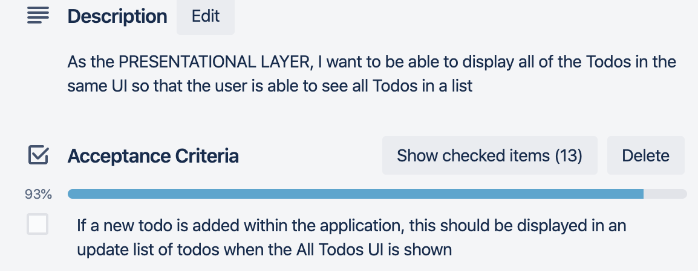
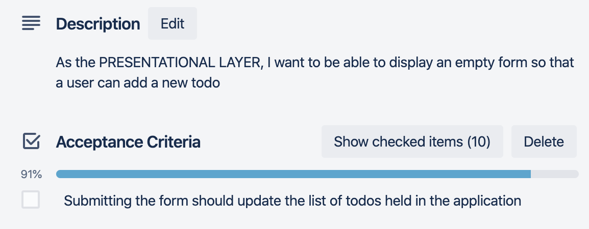

# Stateful Version Activities

## Peer Group Activity - Activity 11 - Thinking in React Part 3 - Identifying State in the Todo App

### Outcomes

- To be able to make decisions about what should and should not be state in an application.

### Actions

Consider the following data that is needed in the application and decide
whether it should be state or not:

- The List of Todos;
- The Description property of a NEW todo;
- The Date Created property of a NEW todo;
- The Completed property of a NEW todo.

The **Acceptance Criteria** should be considered:





---

#### Example Solution

<details>

Note that this is not necessarily the \'right\' answer, it is one of
several possibilities:

**List of Todos**
*Does it remain unchanged over time?*

According to the new Acceptance Criteria, this list may change as a result of the user adding new todos when they are using the application. On this basis, this data needs to be held in state at this point in the application development.  

It is not passed in from a parent via props and it cannot be computed based on any other state or props.  

**The Description property of a new Todo**  
*Does it remain unchanged over time?*

As the description of a new Todo is provided by user input on the form, this is likely to change over time as the user will input text on the form. On this basis, this data needs to be held in state so that it is available for the process of adding a new Todo.  It is not passed in from a parent via props and it cannot be computed based on any other state or props.  

**The Date Created property of a new Todo**  
*Does it remain unchanged over time?*  

As the value of time increments as the application is used and the time is required for recording when the todo was created, this needs to be held in state so that the most current value can be used when submitting a new todo.  It is not passed in from a parent via props and it cannot be computed based on any other state or props.  

**The Completed property of a new Todo**  
*Does it remain unchanged over time?*  

All new todos to the list will start with a false completed property when they are created. As the application currently has no mechanism to update/edit a todo, this property will not change over time and therefore does not need to be stored in state as a result of this question.  Essentially, it can be computed based on other data within the application - in this case it will be a constant of false!

</details>

>This is the end of this activity

---

## Peer Group Activity 12 - Thinking in React Part 4 - Identifying where State should live in the Todo App

## Objectives

- To be able to place the identified state in an application in an appropriate component.

### Action 1 - List of todos

Identify where the list of todos should live as state in the application.

To work out where state should live:

- Identify every component that renders something based on the list of todos;
- Find common owner component of all of the components;
  - Either common component or component even higher up should own state;
  - If no component makes sense, create new component to hold state and
    add it into the hierarchy above the common owner component.

## Action 2 - All properties of a 'new' or 'updated' Todo

Identify where the all of the properties of a 'new' or 'updated' Todo should live as state in the application.

To work out where state should live:

- Identify every component that renders something based on the individual properties of a 'new' or 'updated' Todo;
- Find common owner component of all of the components;
  - Either common component or component even higher up should own state;
  - If no component makes sense, create new component to hold state and add it into the hierarchy above the common owner component.

---

### Example Solution - Action 2

<details>

**List of todos**

The **list of todos** needs to be accessed by the **AllTodos** component but it also needs to be updated as a result of the **AddEditTodo** component. This strongly suggest that the **list of todos** should live in a common parent component and in the hierarchy of this application, that is seemingly the **App** component. The **todos** can then be passed to the **AllTodos** as props and when the list is updated, the application will update as a result of this state changing. The functionality for updating the list is not considered yet.

**New Todo**

As data for the new or updated todo comes from the **TodoForm**, there needs to be state within the **TodoForm** for the **Todo Description** and **Todo Date Created** and **Todo Completed**. *We are not dealing with the submission of the todo at this point, so functionality to pass the data back to the parent component is not considered*. Each todo property's state will be updated by the use of an **onChange** event trigger for the **Description** or **Completed** state and an **updateDateCreated** trigger on the **DateCreated** component.

You will notice that the **DateCreated** component also holds internal state for its functionality.

</details>

>This is the end of this activity.

---

## ACTIVITY 13a - Thinking In React Part 4 - Adding State

### Outcomes - Activity 13a

- To be able to add state to components and pass it as props to child components.
- To be able to update state using events and test that the state change updates the render.

### Overview - Activity 13a

In this activity, you will add **state** to the **App** and **TodoForm** components and modify the application to pass the state down as props where it is needed. The import of **sampleTodos** will need to be moved to the **App** component and then set as the *initial state* for **todos**. This state will then need passing to the **AllTodos** component, removing some of the technical debt introduced through using static data straight into this component. The *values* on the **TodoForm** will also be tracked by adding **state** to this component and using the **onChange** event to update state.

Once this has been completed, the application will be tested again to ensure that all tests pass, fixing the tests where necessary to reflect changes made.

**Note:** The submission of the **TodoForm** is not covered in this activity. It is covered in Part 5 of Thinking in React.

Remember to refer back to the Acceptance Criteria for this part of the application too.

You may either continue in the **StaticVersion/starter** folder ***OR*** if you did not complete all parts of that, you can pick up with the **StatefulVersion/starter** folder. Remember, if you choose the latter, you will need to run **npm install** and start the application.

### Action 1 - Add state to the App Component

1. Open **App.js** for editing from your project folder.
2. Add `{ useState }`  imports from `react`.
3. Add an import of `sampleTodos` from **./sampleTodos.json**.
4. In the App function, *before the return*, add the line introducing a **state** called `todos` with an initial value of `sampleTodos`.
5. In the **return**, add a **prop** to the **AllTodos** component called `data` set to `{{todos}}` - the double `{{}}` are intentional.
6. Save the file.

### Action 2 - Make AllTodos use the todos from props

1. Open **Components/AllTodos.jsx** for editing.
2. *Remove* the import for sampleTodos.
3. Allow **AllTodos** to receive a **prop** of `{data}` by adding this to the *arrow function* arguments.
4. Modify the map function to use `data.todos` rather than `sampleTodos`.
5. Ensure that the data prop is check through PropTypes. It needs to:
    - Have a **key** of `data` that is an **exact** *object shape* of:
        - A **key** of `todos` that is an **array** **of** an **exact**
            *object shape* that has the *4 properties of a todo* listed
            with the *correct types* associated to each key.

> Don't forget to import the `PropTypes` symbol.

6. Save the file.

7. Run the tests for this project.

> You should find that the test for **AllTodos** now fails. This is because **AllTodos** now expects to receive a **prop** of **data** and the create function doesn't provide this.

8. Open **tests/AllTodos.test.js** for editing.
9. In the create function that renders the **AllTodo** component, add a property of `data` set to an object with a **key** of todos and a **value** of `sampleTodos`.
10. Save the file and run the tests again.

> You should find that the test passes as a result of the change.

### Action 3 - Add state to the TodoForm Component

1. Open **TodoForm.js** for editing from your project Components folder.
2. Add `{ useState }` imports from `react`.
3. In the function, add state for:
    - `todoDescription`, initially setting it as an *empty string*;
    - `todoDateCreated`, initially setting it to `null`;
    - `todoCompleted`, initially setting it to `false`.

4. In the **form**, find the **input** for `todoDescription` and add properties:
    - `value` set to `todoDescription`;
    - `onChange` set to an arrow function that receives `event` and calls `setTodoDescription` with `event.target.value`.
5. Find the `DateCreated` component and add the property `updateDateCreated` and set to an arrow function that receives
        `dateCreated` and calls `setTodoDateCreated` with it.
6. Find the **input** for `todoCompleted` and add properties:
    - `checked` set to `todoCompleted`;
    - `onChange` set to an arrow function that receives `event` and calls `setTodoCompleted` with `event.target.checked`.

7. Find the **input** for `submit` and:
    - Add a `disabled` property that is set to `!todoDescription`;
    - Set the input's `className` to `btn` and conditionally append either `btn-primary` when `enabled` or `btn-danger` when `disabled` - you should use a *ternary* and the `todoDescription` property.
8. Save the files and run the application.

You should find that the application still works. Additionally, the Component React Developer tools should show:

- The value of state in the App component as an Array of Objects, which when inspected are the 4 todos from the **sampleTodos.json** file
- The values of props in the **AllTodos** component - namely **todos** that is set to the same array as the state in the App component!
  - The props values of the 4 rendered **Todo** components are still
        there also.
- The values of state in the **TodoForm** component, these should update as you enter data in the input, the passage of time and changing the value of the checkbox.

> Run the test specs again and check that all still pass.
> This is the end of this activity.

---

## ACTIVITY 13b - Thinking In React Part 4 - Testing Event Handlers

### Outcomes - Activity 13b

- To be able to test that event handlers update the component using `userEvent`

### Overview - Activity 13b

In this activity, you will test that the **onChange** handlers for the inputs update the **state** in the **TodoForm** component. You will need to add to the **TodoForm** test suite with a suite of **onChange** event tests. There needs to be a test that checks that the value of the description input changes to the specified value when its **onChange** is called and a test that checks the value of the **checkbox** for **todoCompleted** changes when **toggled**.  We also should check to see if the submit button is enabled and disabled correctly.

It is worth noting that the **todoDateCreated** update is not tested here. That is because the change is tested within the **DateCreated** tests. The updating of state in this component is trusted to the ReactJS library testing.

Continue working in the **StatefulVersion/starter** folder.

### Set Up Action

In the project root, open a terminal and install the `user-event` package as a development dependency:

```sh
npm i --save-dev @testing-library/user-event
```

The `userEvent` function should be made a ***default*** import from this package in any test file it is used in.

### Action 1 - Test the onChange event on the todoDescription input

1. Open **tests/TodoForm.test.jsx** for editing
2. Move the `beforeEach` that `render`s a `TodoForm` component out of the first nested suite
3. Nest another suite under the previous one with the title `Form manipulation tests`
4. Add an `async` test with a title of `it should render the new value in the input when todoDescription is updated` and an arrow function that:
    - Sets a `const` `testDesc` to the string `Test description`;
    - Sets a `const` `descInput` to a `getByPlaceholderText` query on `screen`, looking for the regular expression `/todo description /i`
    - Checks that the current value of `descInput` is an empty string
    - Acts on `descInput` by using it to `await` a `userEvent.type` call along with `testDesc`
    - Asserts that `descInput` now has a value of `testDesc`

### Action 2 - Test the onChange event on the todoCompleted checkbox

1. Add another `async` test with the title `it should render the new value in the checkbox when the todoCompleted onChange function is activated` and an arrow function that:
   - Sets a `const` `completedCkbx` to a `getByRole` query on `screen` looking for `checkbox`
   - Checks that the `completedCkbx` is NOT currently checked (use the `toBeChecked()` matcher with negation (`.not.`))
   - Acts on `completedCkbx` by using it `await` a `userEvent.click` call
   - Assert that `completedCkbx` is checked

### Action 3 - Test that the Submit button is enabled/disabled appropriately

1. Add a further `async` test with the title `should enable the submit button when the todo description is populated` and an arrow function that:
   - Sets a `const` `testDesc` to the string `Test description`;
   - Sets a `const` `descInput` to a `getByPlaceholderText` query on `screen`, looking for the regular expression `/todo description /i`
   - Sets a `const` `submitBtn` to a `getByDisplayValue` query on `screen`, looking for the regular expression `/submit/i`
   - Check that `submitBtn` is currently disabled (use `toBeDisabled()`)
   - Simulate typing into the `descInput` box with `testDesc` (using `userEvent` preceded by `await`)
   - Assert that `submitBtn` is no longer disabled

2. Save the file and run the tests - do all pass?

>This is the end of this activity.

---

## ACTIVITY 14a - Thinking In React Part 5 - Adding Inverse Data Flow

### Outcomes - Activity 14a

- To be able to add inverse data flow to an application by passing handler functions by props

### Overview - Activity 14a

In this activity, you will add inverse data flow to the application and ultimately update the array of todos in the App component. To start this process, in **TodoForm**, you will allow the user to submit the form, triggering a *submit handler function* on it. This will stop the default action from happening, call a function that will be passed in through its props with the **todo** values and then reset them to *empty values*.

Moving up the chain to the **AddEditTodo** component, you will create a function to pass to the **TodoForm**. This function will take the data for a new (or edited) **Todo** and generate an ID for it (using the provided **utils/generateId** function). This will create a new **todo** and call the function this component receives through props with it.

The top of this inverse data flow is the **App** component. You will define a submit handling function that receives the new **Todo** and adds it to the array of **todos** it already has. This will trigger a re-render of all components that depend on this.

Remember to refer back to the Acceptance Criteria for this part of the application too.

You may continue in the **StatefulVersion/starter** folder or extend **solution-activity13**.

### Action 1 - Add a submit handler to TodoForm

1. Open **TodoForm.jsx** for editing.
2. Import `PropTypes` from `prop-types`.
3. At the bottom of the file, before the export statement, declare `TodoForm.propTypes` to be an *object*, it should have a **key** of `submitTodo` and a **value** of `PropTypes.func.isRequired`.
4. Make this component receive `props` by adding `{submitTodo}` to the arguments of the function.
5. In the **TodoForm** function, under the **state** declarations, add an *arrow function* called `handleSubmit` that takes an argument of `event`. The arrow function body should:
    - Call `preventDefault` on `event`;
    - Call `submitTodo` with the *3 state values*;
    - Set each of the **state** back to the *default values* initially provided.
6. In the `form` tag, add an attribute of `onSubmit` set to `handleSubmit`.
7. Save the file.

### Action 2 - Add a submit handler to AddEditTodo

1. Open **AddEditTodo.jsx** for editing.
2. Import `PropTypes` from `prop-types`.
3. At the bottom of the file, before the **export** statement, declare `AddEditTodo.propTypes` to be an *object*, it should have a **key** of `submitTodo` and a **value** of `PropTypes.func.isRequired`.
4. Import `TodoModel` from **'./utils/Todo.model'**.
5. Make this component receive `props` of `submitTodo` by adding it to the arguments of the function.
6. Add an *arrow function* called `submitTodoHandler` to the component, it should:

- Receive `todoDescription`, `todoDateCreated` and `todoCompleted`;
- Define a `const` called `todo` that calls the **constructor** for `TodoModel` with `todoDescription`, `todoDateCreated` (converted to an ***ISO String IF it exists***) and `todoCompleted`;
- Call `submitTodo` with the `todo`.

1. In the `return` of the function add an **attribute** of `submitTodo` to the **TodoForm** component with a value of `submitTodoHandler`.
2. Save the file.

### Action 3 - Add a submit handler to App

1. Open **App.js** for editing.
2. Add an import of `generateTodoId` from **'./Components/utils/generateId'** to allow temporary generation of the `_id` being allocated by MongoDB
3. Under the **state** declaration, add an *arrow function* called `submitTodo`, it should:
   - Receive `todo`;
   - Set `todo` to be itself with a ***key*** of`_id` added with its value created by a call to `generateTodoId` - we will remove this later so no need for it to be tested!
   - Declare a `const` called `updatedTodos`, defined as an **array** that has a ***spread*** of `todos` as its first element and `todo` as its second element (see snippet below);
   - Call `setTodos` with `updatedTodos`.

```jsx
    todo = { ...todo, _id: generateTodoId()};
    const updatedTodos = [...todos, todo];
```

1. In the render of the function, add an **attribute** of `submitTodo` to the **AddEditTodo** component with a value of `submitTodo`.
2. Save the file.

Run the application and check that adding a new **todo** updates the application.

>This is the end of this activity

---

## ACTIVITY 14b - Thinking In React Part 5 - Testing Form Submission

### Objectives - Activity 14b

- To be able to add inverse data flow to an application by passing
    handler functions by props

### Overview - Activity 14b

In this QuickLab, you will test the submission of the form triggers the submit function that is passed in through props. The function will be mocked and spied on to ensure that it is called. Tests should also check that the state values are reset on submission. This will be achieved by creating an instance of the **TodoForm** component with an appropriate prop for **`submitTodo`** - this will need to be added to all instances of the **TodoForm** component that are created in this test file to maintain the correct construction for each test. Asynchronous calls will be made to the **`onChange`** methods to update values and then the **`onSubmit`** event should be fired. The assertions from this test is that the **`submitTodo`** function has been called once with the values for description and completed as set in the asynchronous calls and null for the date created. Further assertions should be made to check that the values of description and completed are reset to an empty string and false, respectively.

You should continue working on the same project as you used for Activity
14a.

### Action 1 - Fix the test warnings

1. Run `npm test` you should find that there are warnings due to a missing `prop`.
2. Fix the warnings by retro-fitting the renders of the `AddEditTodo` and `TodoForm` components with a `submitTodo` property that passes in a mock function.
   - The first line in each top-level suite should be:

```jsx
    const mockSubmitTodo = vi.fn();
```

- Each render method should now read:

```jsx
    render(<AddEditTodo submitTodo={mockSubmitTodo} />);
```

3. Do not proceed until all tests are passing *with no warnings*.

### Action 2 - Check that the TodoForm calls mockSubmitTodo

1. Make sure that you are working in the file **TodoForm.test.js**
2. Add a nested suite called `Form submission tests` and its arrow function.
3. Write an `async` `test` called `test the submitTodo prop function is called when submit button is clicked` with an arrow function that:
   - Use similar code from the `enable submit button` test to enable the button
   - *Awaits* a `click` call with the button to simulate the user submitting the new todo
   - *Asserts* that the `mockSubmitTodo` function has been called 1 times.
   - *Asserts* that the `mockSubmitTodo` function has been called with `testDesc, expect.any(Date), false, undefined`
4. Save the file and check that the tests pass.

> The `expect.any(Date)` here is used to assert that the value the test is called with has a valid date as well as the other vales for the todo. We can't assert on the actual value of Date as it will be dynamic and change each time the test runs.

### Action 3 - Check that the AddEditTodo component calls mockSubmitTodo

#### Action 3.1 - test AddEditTodo calls `mockSubmitTodo` correctly

1. Open **AddEditTodo.test.jsx**
2. Add an `async` `test` to the existing suite with the title `it should call mockSubmitTodo when the form is submitted` and an arrow function that:
   - Sets a `const` `testDesc` to the string `Test description`;
   - Sets a `const` `descInput` to a `getByPlaceholderText` query on `screen`, looking for the regular expression `/todo description /i`
   - Sets a `const` `submitBtn` to a `getByDisplayValue` query on `screen`, looking for the regular expression `/submit/i`
   - Simulates typing `testDesc` in the `descInput` by calling `type` on `userEvent` and `await`ing the result
   - Simulates clicking on `submitBtn` by calling `click` on `userEvent` and `await`ing the result
   - *Asserts* that `mockSubmitTodo` was called *exactly once*
   - *Asserts* that the `mockSubmitTodo` was called *with* any instance of `TodoModel`

> The TodoForm tests check that the values supplied by the form are used to call the submit method, here we are interested if these values are actually converted into the TodoModel needed for submitting the data.

Remember to add `screen` to the imports from `@testing-library/react`
Remember to import `userEvent` from `@testing-library/user-event` (no `{ }` needed!)

Save the file and make sure that the tests pass before proceeding.

---

### Action 3.2 - Write a test for the App Component

Challenge: can you write a test that checks to see if the todo is actually added to the array when the submit button is clicked?

Answer in the solution file!

>This is the end of this activity

---
