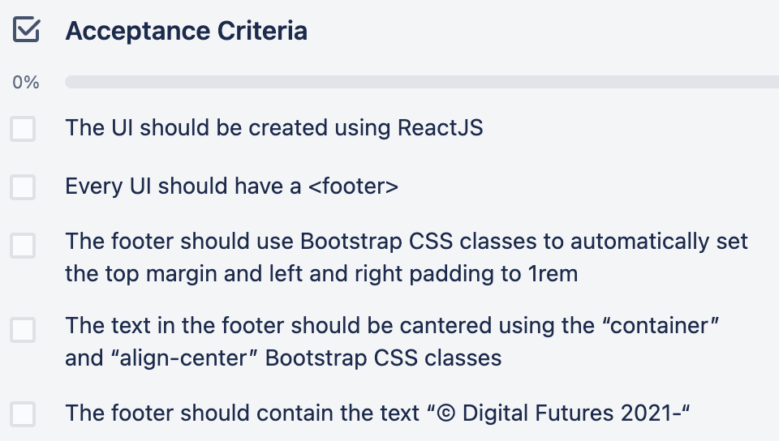
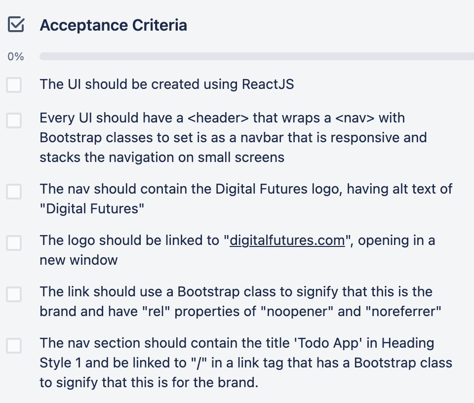
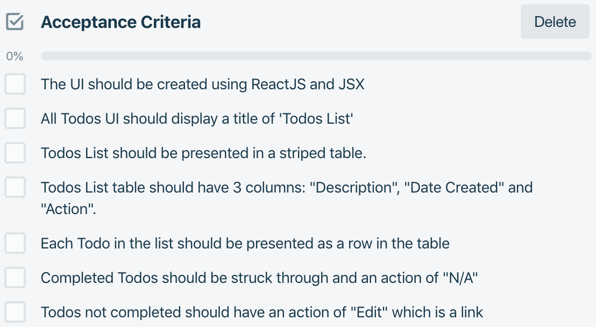
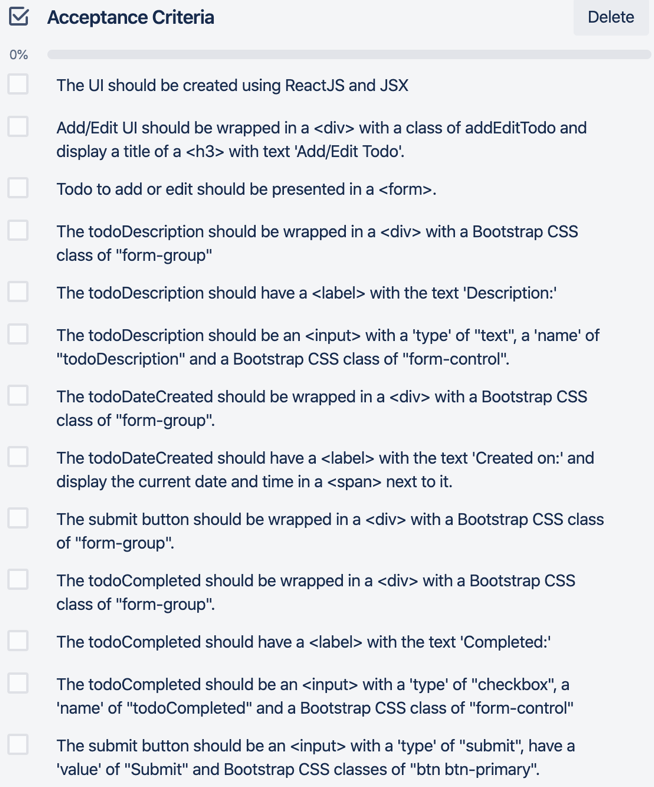
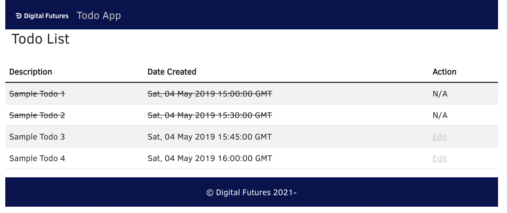
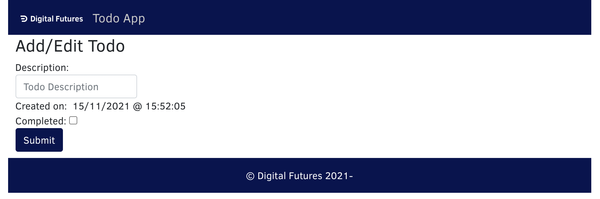
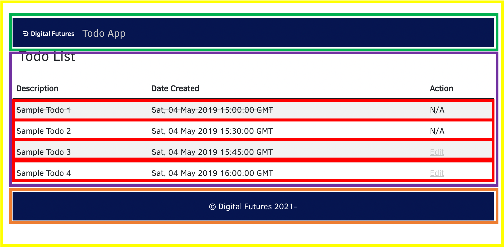
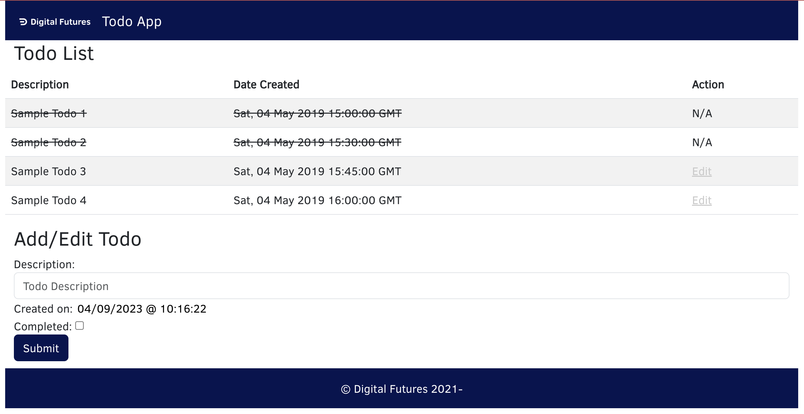
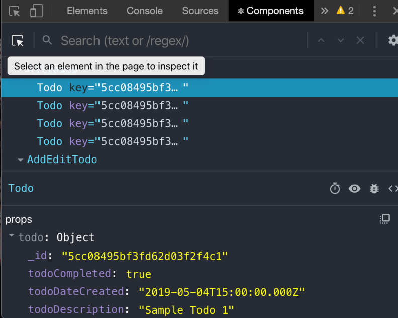

# Creating a Static Version of the App

## ACTIVITY 6 - Thinking in React Part 1 - Component Hierarchy

## Objectives - Activity 6

- To be able to take acceptance criteria, a mock-up and some static data to produce a suitable component hierarchy for an application

## Overview - Activity 6

In this activity, you will use acceptance criteria, the provided mock-ups and static data to identify a component hierarchy for a Todo application. A hierarchy is needed for an 'AllTodos' UI and an 'Add/Edit Todo' UI.

## Actions - Activity 6

1. Using the information provided below, create a component hierarchy for the 'AllTodos' UI and the 'Add/Edit Todo' UI.

### Acceptance Criteria - Common UI Components

| Footer                                                     | Header                                                                      |
| ---------------------------------------------------------- | --------------------------------------------------------------------------- |
|  |                   |
|                                                            | Note the link for Todo App in the header should have class `link-light` too |

### Acceptance Criteria - Specific UI Components

| All Todos View                                                       | Add/Edit Todo View                                              |
| -------------------------------------------------------------------- | --------------------------------------------------------------- |
|  |  |

### Mock Data

A copy of this data is also available in the file **sampleTodos.json**
in **StaticVersion/starter/src**.

#### Notes

- `_id` is in the format generated when an item is added to MongoDB
- `todoDateCreated` is in *ISO Date format* as this is used to store dates/times in MongoDB.

```json
[
  {
    "_id": "5cc084952deb33810d2ec464",
    "todoDescription": "Sample Todo 1",
    "todoDateCreated": "2019-05-04T15:00:00.000Z",
    "todoCompleted": true
  },
  {
    "_id": "5cc08495bf3fd62d03f2f4c2",
    "todoDescription": "Sample Todo 2",
    "todoDateCreated": "2019-05-04T15:30:00.000Z",
    "todoCompleted": true
  },
  {
    "_id": "5cc08495bf3fd62d03f2f4c2",
    "todoDescription": "Sample Todo 3",
    "todoDateCreated": "2019-05-04T15:45:00.000Z",
    "todoCompleted": false
  },
  {
    "_id": "5cc08495bf3fd62d03f2f4c2",
    "todoDescription": "Sample Todo 4",
    "todoDateCreated": "2019-05-04T16:00:00.000Z",
    "todoCompleted": false  
  }   
]
```

### Wireframes/Mock Ups

#### All Todos



#### Add/Edit Todo



>This is the end of this activity.

---

## ACTIVITY 7a - Create Common Header and Footer Components

### Objectives - Activity 7a

- To be able to create static Function components and integrate them into an application

### Overview - Activity 7a

In this activity, you will create the components for the header and footer sections of the application. These components will be placed in the Components folder of the application and linked to the App component to display them. The acceptance criteria should be used as a guide to create the components in the first instance. A step-by-step guide is provided after the Desired Outcome.

### Actions - Header and Footer Acceptance Criteria

You will find that this project has already been set up and imports Bootstrap to enable a fully responsive application to be made. The logo can be found in the Components/images folder as an SVG and should be imported into the header. Additional CSS has been provided (along with branding fonts) and is imported into the **index.js** file so it is available anywhere in the Component tree.

Make sure that you have run `npm i` for the project before beginning.

1. Use the acceptance criteria from Activity 6 to create Header and Footer components.
2. Import these into the App component to display them.

### Desired Outcome


#### Header Stepped Instructions

1. In **StaticVersion/starter/src/Components** create a new file called **Header.jsx**.
2. Add an import of logo from \'./images/logo.svg\'.
3. Create a **Function component** called Header that has *no parameters*.
4. The return of the component should have wrapping `<header>` and
    `<nav>` elements:
    - `<nav>` should have classes `navbar navbar-expand-sm`;
    - A **link** to <https://www.digitalfutures.com> with a **`className`** of `navbar-brand`, a **`target`** of `_blank` and a **`rel`** of `noopener noreferrer`;
    - The **link** should contain an **image** whose **`src`** is **`{logo}`**, and **`alt`** is DigitalFutures and **`width`** is `100`;
    - A **sibling link** to `/` with a **`className`** of `navbar-brand link-light` and
        **text** of `Todo App`.
5. `export` `Header` as `default`.
6. Save the file.
7. Open **App.js** from **/src** for editing.
8. Add an `import` for `Header` from `./Components/Header`.
9. Within the outer `<div>`, add a **child** of `<Header />` as an **older sibling** of the inner `<div>`.
10. Save the file.

#### Footer Stepped Instructions

1. In **src/Components** create a new file called **Footer.jsx**.
2. Create a **Function component** called **Footer** that has *no parameters*.
3. The return of the component should have wrapping `<footer>` element that:
    - Has Bootstrap classes of `mt-auto` (to set the top margins to automatic), `py-3` (to set padding left and right to 1rem), `text-center` and `container`;
    - Has text content of `© Digital Futures 2021-.
4. `export` `Footer` as `default`.
5. Save the file.
6. Open **App.js** from **src** for editing.
7. Add an `import` for `Footer` from `./Components/Footer`.
8. Within the outer `<div>`, add a **child** of `<Footer />` as a **younger sibling** to the inner `<div>`.

Save the file.

Use `npm run dev` to run the application and check that the output is as shown in the desired outcome as above.

>This is the end of this activity.

---

## ACTIVITY 7b - Write Snapshot Tests

### Objectives - Activity 7b

- To understand how to write a simple Snapshot tests

### Overview - Activity 7b

In this activity, you will add 2 tests to the `tests` folder, one for the `Header` component and one for the `Footer` component. These should be simple snapshot tests as the components will not change much one development is complete.  You will use the create function to create a version of the component and then expect it **toMatchSnapshot**. The **`npm test - --coverage**` command will be used to run the tests and create coverage reports.

Remember that the test may initially fail as there is no snapshot and that if you change the code in the component, you will need to update the snapshot to make the test pass again.

### Actions - Test the Header

1. In the **tests** folder, create a new file called **Header.test.jsx**.
2. `import` `render` from `@testing-library/react`.
3. Import the `Header` component from the **Header** file in the **Components** folder.
4. Write a test with the **title** Header matches snapshot and a **callback function** that:
    - `expect` a call the result of a call to `render`, passing `<Header />` as an argument that uses the matcher `toMatchSnapshot()`.
5. Save the file.
6. Check that the test runs and passes.

### Actions - Test the Footer

1. Repeat the process above, substituting the Header for Footer.

### Ensure the tests fail

1. Change some of the displayed text inside appropriate tags in both of the component files and save them.
2. Observe that the tests now fail - DO NOT UPDATE the snapshots.
3. Change the text back to the original and ensure that the tests pass again.

>This is the end of this activity.

---

## ACTIVITY 8 & 9 are in the IntroToReact folder

---

## ACTIVITY 10a - Thinking in React Part 2 - A Static Version - Components with static data

## Outcomes - Activity 10a

- To be able to use static external data to populate components
- To be able to use the map function to create multiple components
- To be able to conditionally render items dependent on some value

## Overview - Activity 10a

In this activity, you will use the data supplied in the file **src/sampleTodos.json** to populate the AllTodos view. You should use the component hierarchy identified earlier (and shown below) and the Acceptance Criteria to produce the components needed for the AllTodos UI. A Todo model (basically a JavaScript class to define the shape of a Todo) has been defined in the **./utils** folder for use with the **`instanceof`** **`PropTypes`** check.

Continue working in the **StaticVersion/starter** folder.

### Component Hierarchy



| Component    | Colour                                               |
| ------------ | ---------------------------------------------------- |
| **App**      | <span style="color: rgb(255, 255, 0)">Yellow</span>  |
| **Header**   | <span style="color: rgb(0, 176, 80)">Green</span>    |
| **AllTodos** | <span style="color: rgb(112, 48, 160)">Purple</span> |
| **Todo**     | <span style="color: rgb(255, 0, 0)">Red</span>       |
| **Footer**   | <span style="color: rgb(237, 125, 49)">Orange</span> |

### Acceptance Criteria


---

### Desired Outcome  - Activity 10a


## Action 1 - The Todo component

1. Create a new file in the **src/Components** folder called **Todo.jsx**.
2. Insert the *boilerplate code* for an *empty Function component* that receives a **prop** of `{todo}`.
3. *Import* `PropTypes` from `prop-types`.
4. *Import* `TodoModel` from `./utils/Todo.model`.
5. Set a `const` `dateCreated` to be a `new Date` that **parses** the `todo.todoDateCreated` and converts it to a **UTC string**.
6. Set a `const` `completedClassName` that is *conditionally set* to `completed` if `todo.todoCompleted` is **true** and an *empty string* if not.
7. Declare a variable `completed`.
8. Use an `if` statement to set `completed` to the **string** `N/A` *if* `todo.todoCompleted` is **true** and to the *markup* `<a href="/">Edit</a>` if not.
9. **Return** a **table row** that has *3 cells* whose *first 2* have a `className` set by `completedClassName` and whose **content** is `todo.todoDescription` and `dateCreated` respectively. The *final cell* should **render** the `completed` variable.
10. **Before** the `export` statement add `Todo.propTypes` as an **object** that sets a **key** of `todo` to be a **call** to `instanceOf` on `PropTypes`, passing `TodoModel` as the argument.
11. Save the file.

## Action 2 - The AllTodos component

1. Create a new file in the **src/Components** folder called **AllTodos.jsx**.
2. Insert the boilerplate code for an empty Function component that receives *no props*.
3. Import the provided CSS file for **AllTodos** found in the **css** folder.
4. Import sampleTodos from the **sampleTodos.json** file.
5. Import `Todo` from the **Todo** file.
6. `TodoModel` should be imported from **./utils/Todo.model**.
7. Inside the component function, set a `const` `todos` that **maps** the `sampleTodos` array with an arrow function that:
    - Takes `currentTodo` as an argument;
    - Has a line in the function body that creates a **`new`** `TodoModel` called `todo` by passing in the properties from `currentTodo` in the order **`description`**, **`dateCreated`**, **`completed`** and
        **`_id`** into the **`TodoModel`** *`constructor`*;
    - **Returns** a `Todo` component with a **property** of `todo` set to
        the `todo` and a `key` of the ***todo's `_id`***.
8. Make the component **return** a wrapping `div` with a `className` of `row` with:
    - A `h3` with **text** of `Todo List`;
    - A *sibling table* with *classNames* `table` and `table-striped`;
    - A `thead` that has a *table row* that has the 3 headings **Description**, **Date Created** and **Action**;
    - A `tbody` that renders the *array* of `todos`.

**Hint:**

<details>

An array of JSX Components can be simply put inside a set of curly braces

```jsx
    ...
    <tbody>
        {todos}
    </tbody>
```

</details>

9. Save the file.

## Action 3 - Render the AllTodos component

1. Open **App.js**.
2. Replace the placeholder text inside the inner `div` with the *`className`* `container` with an `AllTodos` component.
3. Save the file and fire up the application.

> Your output should look like the desired outcome.
>This is the end of this activity.

---

## ACTIVITY 10b - Thinking in React Part 2 - A Static Version - Testing Components with static data

### Outcomes - Activity 10b

- To be able to test that a component renders the correct number of children
- To be able to test that a component renders conditional items correctly dependent on a prop

### Overview - Activity 10b

In this activity, you will write tests for the Components you have just made. The **AllTodos** component should be tested to ensure that the number of **Todo** components rendered is the same as the length of the static array that has been used to generate it. The **Todo** component is a little more convoluted, as there are 2 conditional statements that affect the output, both based on the **todoCompleted** status. You should test to see if the correct **className** is added to the **Description** and **Date Created** cells and also that the correct text is displayed in the **Action** cell.

Continue working in the **StaticVersion/starter** folder.

### Action 1 - Write Tests for the AllTodos Component

1. In the **src/tests** folder, create a new file called **AllTodos.test.jsx**.
2. Import `{ render, screen }` from `@testing-library/react`, `AllTodos` from **../Components/AllTodos** and `sampleTodos` from **../sampleTodos.json**.
3. Write a test with the title `it should render the correct number of Todo components based on the todo array supplied` and add the arrow function.
4. Populate the arrow function with:
    - A `const` called `sampleTodosLength` set to the `length` of `sampleTodos`;
    - Call `render` passing in an `AllTodos` component that has a prop of `todos` set to `sampleTodos`
    - Defines a `const` called `numberOfRows` that is set to `getAllByText` query on `screen`, looking for the RegEx `/sample/i`
    - **Asserts** that the `numberOfRows` *to have length* `sampleTodosLength`.
5. Save the file and run the tests.

> All tests should pass, including the new test on **AllTodos**. For peace of mind, change the value of **sampleTodosLength** to any value other than 4 (as this is the actual value) and check that it fails.

### Action 2 - Write Tests for the Todo Component with a Todo completed

1. In the **src/tests** folder, create a new file called **Todo.test.jsx**.
2. Import `{ render, screen }` from `@testing-library/react`, `Todo` from **../Components/AllTodos** and `TodoModel` from **../Components/utils/Todo.model**.

#### Write the test suites

1. Create a wrapping test suite (`describe` call) that has the title of `Todo test suite` and an arrow function.
2. In this suite, make variable declarations for `testTodo`, `todoDescription` and `todoDateCreated`.
3. Add a `beforeEach` that:
   - initialises `testTodo` to be a new instance of `TodoModel`
   - Deconstructs the `testTodo` to `todoDescription` and `todoDateCreated`

**Hint:**

<details>

```jsx
    ({ todoDescription, todoDateCreated} = testTodo);
    // Note the brackets surrounding the deconstruction statement!
```

</details>
<br />

1. Nest another test suite with the title `Testing render when todoComplete is true` and an arrow function.
2. Inside this suite, write a `beforeEach()` which calls `render` passing in the following mark-up:

```jsx
    render(
        <table>
            <tbody>
                <Todo todo={testTodo} />
            </tbody>
        </table>
    );
```

6. Write a test with the title `it should render 2 tds with className completed` and add the arrow function.
7. Populate the arrow function with:
    - A `const` called `date` set to be a *new instance* of `Date` parsed to a UTC String (use `.toUTCString()`);

>The `<Todo />` component has to be wrapped in a `<table>` and `<tbody>` elements to preserve the rules of HTML - `Todo` renders `<tr>`s and `<td>`s and these should only be inside these wrappers

-
  - Defines a `const` called `descriptionCell` that is set to a `getByText` query on `screen` looking for `todoDescription`;
  - Defines a `const` called createdCell set to the result of `getByText` query on `screen` looking for `date`;
  - **Asserts** that the `className` property of `descriptionCell` is `completed`;
  - **Asserts** that the `className` property of `createdCell` is `completed`;

7. Save the file and verify that the test passes.

### Action 3 - Write Tests for the Todo Component - rendering the correct value when completed is true

1. Write another test with the title `it should render 'N/A' in the last td of the row` and add the arrow function.
2. Populate the arrow function with:
    - A `const` called `expectedAction` set to be the string`N/A`;
    - **Assert** that the `getByText` query on `screen` looking for `expectedAction` is in the document.
3. Save the file and verify that the test passes.

### Action 4 - Tests for when `todoCompleted` is `false`

Using the previous suite as a template, write a second test suite with the title `Testing render when todoCompleted is false`

The trick is to remember that in the `beforeEach` for this suite, you should set `testTodo.todoCompleted` to `false` ***BEFORE*** rendering the component.

You should `expect` the `className` of `completed` ***not*** to be present on the elements.
You should expect the action `Edit` `toBeInTheDocument()`.

>This is the end of this activity.

---

## ACTIVITY 10c - Thinking in React Part 2 - A Static Version - Adding a Form

### Outcomes - Activity 10c

- To be able to add a static, non-interactive form to an application

### Overview  - Activity 10c

In this activity, you will create the components needed to put the UI to add or edit a Todo into the application. Use the acceptance criteria and the mock-up provided to help. A **TodoForm** component will be created that allows the input of the todo's description, uses a supplied utility component called **DateCreated** (available in **/Components/utils**), provides a checkbox for the 'completed' status and a submit button. A wrapping **AddEditTodo** component will be created to provide the title and render the form and this will be added under the **AllTodos** component in the **App** component.

Continue working in the **StaticVersion/starter** folder.


### Desired Outcome - Activity 10c



### Action 1 - Create the TodoForm Component

1. In the **Components** folder, create a new file called **TodoForm.jsx**.
2. Add the boilerplate code to create a Functional component that does not receive any props.
3. Import `DateCreated` from **'./utils/DateCreated**.
4. Make the function **return** a wrapping **form** with an `aria-label` attribute set to `form` that encloses:
    - A **div** with a **className** of `form-group` containing:
        - A **label** **for** `todoDescription` with the **content** of `Description:&nbsp;`
        - A **text** **input** with a **name** of `todoDescription`
        - A **placeholder** of `Todo Description` and a **className** of `form-control`.
    - A **div** with a **className** of `form-group` containing:
        - A **label** **for** `todoDateCreated` with the **content** of `Created on:&nbsp;`
        - A **DateCreated** component.
    - A **div** with a **className** of `form-group` containing:
        - A **label** **for** `todoCompleted` with the **content** of `Completed:&nbsp;`
        - A **checkbox** **input** with a **name** of `todoCompleted`.
    - A **div** with a **className** of `form-group` containing:
        - A **submit** **input** with a **value** of `Submit` and
            **classNames** `btn` and `btn-primary`.
5. Save the file.

### Action 2 - Create the AddEditTodo Component

1. In the **Components** folder, create a new file called **AddEditTodo.jsx**.
2. Add the boilerplate code to create a Functional component that does not receive any props.
3. **Import** **AddEditTodo.css** from the appropriate path (**./css/AddEditTodo.css**).
4. The **return** of the function should be a wrapping
    **React.Fragment** that encloses:
    - A **div** with **classNames** of `addEditTodo` and `row` that wraps a **h3** element with the **content** `Add/Edit Todo`;
    - A **`TodoForm`** component (imported from **./TodoForm**).
5. Save the File.

### Action 3 - Add the new components to the app

1. Open **App.js** for editing.
2. **Import** and then **add** the **AddEditTodo** component under the **AllTodos** component.
3. Save the file.

> Launching the application in the browser should show the UI as shown in the desired outcome. Additionally, check that the 4 rendered Todo components prop values show in the Component section of the React Developer Tools:



>This is the end of this activity.

---

## ACTIVITY 10d - Thinking in React Part 2 - A Static Version - Test the Form rendering

### Outcomes - Activity 10d

- To be able to make mock components to ensure correct rendering

### Overview - Activity 10d

In this activity, you will create a test file for the **TodoForm** component. It has a sub-component of **DateCreated**, and this will be rendered as part of the test.  It has a `data-testid` property of `dateCreated` to help with the test. The test should **assert** that element with this **data-testid** is present.

Continue working in the **b-static-version/starter** folder.

## Action 1 - Create the test

1. Add a new file called **TodoForm.test.js** to the **tests** folder.
2. Import `{ render, screen }` from `@testing-library/react` along with the `TodoForm` component.
3. Create a test suite with the title `TodoForm test suite`.
4. Add a before each that calls `render` with a `TodoForm` component.
5. Add a suite for `TodoForm render tests` for the set of tests defined next.
6. Create separate tests that:
    - Checks that the Description input and label are rendered by using the query `getByPlaceholderText` on `screen` looking for `Todo Description` to be in the document
    - Checks that the Completed input and label are rendered by using the query `getByRole` on `screen` looking for `checkbox` to be in the document
    - Checks that a DateCreated component is rendered by using the query `getByTestId` on `screen` looking for `dateCreated` to be in the document
    - Checks that a submit button is rendered by using a `getByText` query on `screen` looking for the string`Submit` to be in the document.
7. Save the file and run the tests.

> There should be no test failures.

**If you have time:**

- Write tests for the **AddEditTodo** component, checking that the correct **classNames** are rendered in the `div` and that it does actually render a **form**;

>This is the end of this activity.

---
